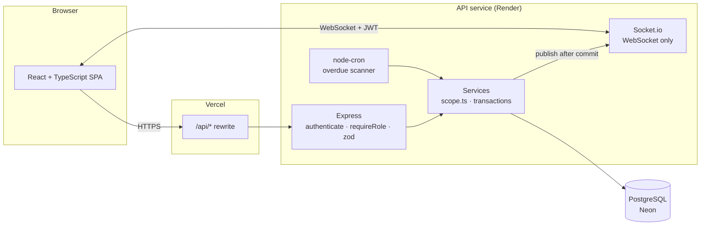
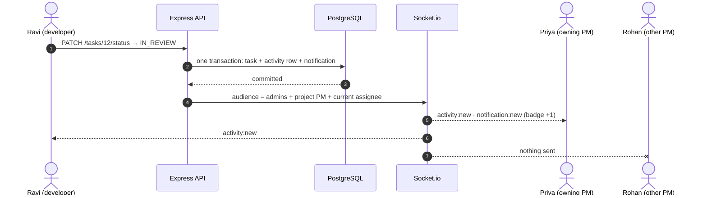
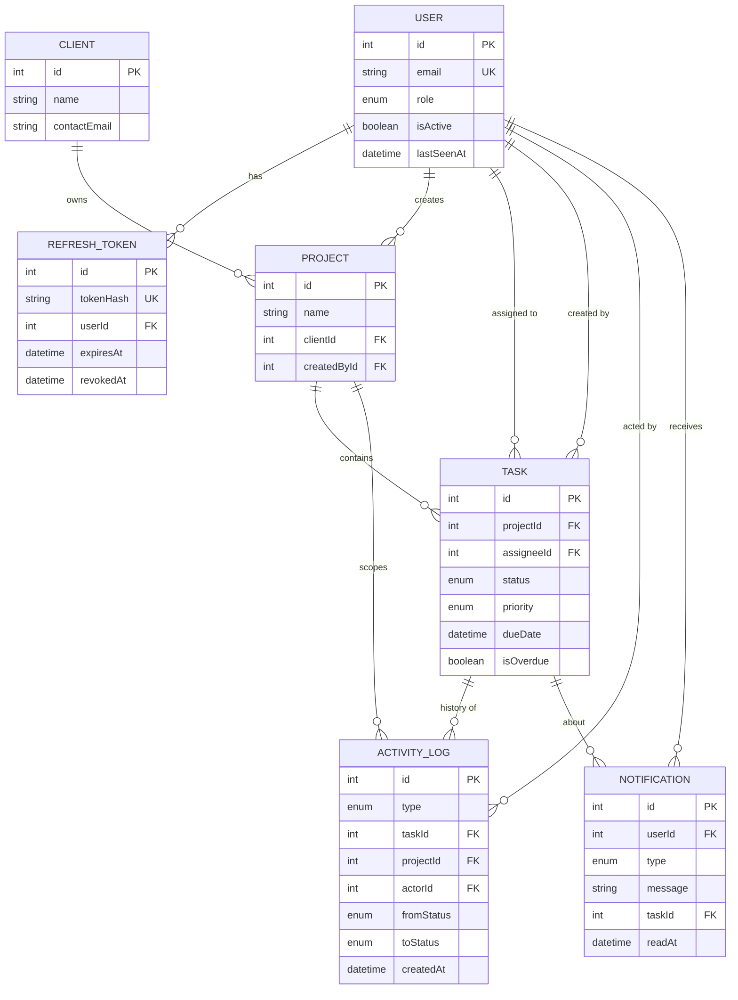

<div align="center">



<br />


**An internal dashboard where an agency manages client projects, tracks tasks and watches the team work, live.**<br />
Three roles. Permissions enforced on the API. A WebSocket feed that only ever shows you what you're allowed to see.

[**Live demo**](#-live-links) &nbsp;·&nbsp; [**Quick start**](#-quick-start) &nbsp;·&nbsp; [**How the live feed works**](#-how-the-live-feed-works) &nbsp;·&nbsp; [**Database**](#-database) &nbsp;·&nbsp; [**Deploy**](#-deploy)

</div>

<br />

## ✨ Highlights

<table>
  <tr>
    <td width="33%" valign="top">
      <h3>🔐 Access enforced at the API</h3>
      Every route is gated by role middleware, and every query is scoped by role. A developer hitting a PM's endpoint with a doctored token gets <code>401</code>; asking for someone else's task gets <code>404</code>.
    </td>
    <td width="33%" valign="top">
      <h3>⚡ Live, role-filtered feed</h3>
      Move a task and everyone allowed to see it updates instantly over a WebSocket. Admin sees all, PM sees their projects, developers see their own tasks. Nothing to refresh.
    </td>
    <td width="33%" valign="top">
      <h3>📬 Real-time notifications</h3>
      Assignments and "moved to In Review" alerts are stored in the database and pushed live, with an unread badge, per-item and mark-all-read. No polling.
    </td>
  </tr>
  <tr>
    <td valign="top">
      <h3>🕰️ Catch-up for offline users</h3>
      Come back after a break and see the last 20 events you missed, read from Postgres, not from memory.
    </td>
    <td valign="top">
      <h3>⏰ Scheduled overdue flagging</h3>
      A background job flags late tasks, writes them to the activity log and pushes them live. Never computed on page load.
    </td>
    <td valign="top">
      <h3>🔎 Shareable filters</h3>
      Status, priority and due-date range live in the URL as query params, so any filtered view is a link you can send.
    </td>
  </tr>
</table>

<br />

## 🔗 Live Links

| Resource | Link |
|---|---|
| 🌐 **Web App** | https://client-beige-five-76.vercel.app/ |
| ❤️ **API Health Check** | https://velozity-dashboard-nas3.onrender.com/api/health |
| 💻 **Repository** | https://github.com/221fa04470/velozity-dashboard |
> The API runs on a free tier that sleeps when idle. If the first load is slow, give it about 30 seconds.

### Try it in two windows

Sign in with any account below (password for all: **`Password123!`**), open a second private window as a different role, and move a task's status in one window. Watch the other.

| Role | Email | What to look at |
|---|---|---|
| 👑 **Admin** | `admin@velozity.dev` | Global feed, live "people online" count, Clients and Team pages |
| 🧭 **Project manager** | `priya@velozity.dev` | Storefront Redesign and Patient Portal only |
| 🧭 **Project manager** | `rohan@velozity.dev` | Fleet Tracker and Loyalty App only |
| 🛠️ **Developer** | `ravi@velozity.dev` | Only his tasks; moving one to **In Review** pings Priya |
| 🛠️ **Developer** | `meera@velozity.dev` · `karthik@velozity.dev` · `sana@velozity.dev` | Compare what each one can and can't see |

<br />

## 🚀 Quick start

<details open>
<summary><b>Option A: Docker (recommended)</b></summary>

```bash
cp .env.example .env
docker compose up --build
```

Open **http://localhost:5173**. The first boot applies the migration and seeds demo data (only when the database is empty, so restarts never wipe anything).
Start from a clean slate with `docker compose down -v && docker compose up --build`.

</details>

<details>
<summary><b>Option B: Node + your own PostgreSQL (local, Neon, Supabase…)</b></summary>

Needs Node 20+ and a PostgreSQL 14+ connection string.

```bash
# terminal 1: API
cd server
cp .env.example .env            # set DATABASE_URL and both JWT secrets
npm install                     # also runs `prisma generate`
npx prisma migrate deploy       # create the tables
npm run db:seed                 # demo data (wipes the database first)
npm run dev                     # http://localhost:4000

# terminal 2: web app
cd client
cp .env.example .env
npm install
npm run dev                     # http://localhost:5173
```

Generate a secret: `node -e "console.log(require('crypto').randomBytes(48).toString('hex'))"`

</details>

<details>
<summary><b>Environment variables</b></summary>

Nothing is hardcoded. The server refuses to start if a required variable is missing or a JWT secret is shorter than 32 characters.

| Variable | Purpose | Default |
|---|---|---|
| `DATABASE_URL` | Postgres connection string | required |
| `JWT_ACCESS_SECRET` · `JWT_REFRESH_SECRET` | Two different signing secrets | required |
| `ACCESS_TOKEN_TTL_SECONDS` | Access token lifetime | `900` |
| `REFRESH_TOKEN_TTL_DAYS` | Refresh token lifetime | `7` |
| `CLIENT_ORIGIN` | Allowed browser origin(s), comma separated (CORS + Socket.io) | `http://localhost:5173` |
| `COOKIE_SAMESITE` | `lax` · `strict` · `none` | `lax` |
| `OVERDUE_CRON` | Schedule of the overdue scanner | `*/5 * * * *` |
| `SEED_PASSWORD` | Password for the seeded accounts | `Password123!` |
| `VITE_SOCKET_URL` _(client)_ | Where the browser opens the WebSocket | `http://localhost:4000` |

</details>

<details>
<summary><b>Handy scripts (<code>server/</code>)</b></summary>

| Script | What it does |
|---|---|
| `npm run dev` | API with hot reload |
| `npm run typecheck` · `npm run build` | Type-check · compile to `dist/` |
| `npm run db:seed` | Wipe and reseed (`-- --if-empty` seeds only an empty database) |
| `npm run db:migrate` | `prisma migrate dev` while developing |
| `npm run test:e2e` | 60 end-to-end API + WebSocket checks ([details](#-testing)) |

</details>

<br />

## 🏗️ Architecture



<details>
<summary><b>Repository layout</b></summary>

```
client/                     React + TypeScript (Vite)
  src/api/client.ts         in-memory access token, single-flight refresh, replay on 401
  src/auth/                 session bootstrap from the refresh cookie
  src/realtime/             one socket per session: token renewal, reconnect, cache updates
  src/components/, pages/   role-aware UI (never the security boundary)

server/                     Express + TypeScript
  src/modules/<feature>/    routes (HTTP + zod) → service (rules + Prisma)
  src/modules/access/       scope.ts: the single definition of who can see what
  src/realtime/             Socket.io server, presence, publisher (the only code that emits)
  src/jobs/                 overdue scanner
  src/middleware/           authenticate, requireRole, central error handler
  prisma/                   schema, migration, seed
  scripts/e2e.mjs           end-to-end checks
```

</details>

<br />

## 🔐 Who can do what

| | 👑 Admin | 🧭 Project manager | 🛠️ Developer |
|---|:---:|:---:|:---:|
| Manage users and clients | ✅ | ❌ | ❌ |
| Create projects and tasks | ✅ all | ✅ own projects | ❌ |
| See projects | all | own only | ones containing their tasks |
| See tasks | all | own projects | assigned to them only |
| Change a task's status | ✅ | ✅ | ✅ own tasks only |
| Activity feed | global | own projects | own tasks |
| Live "online now" count | ✅ | ❌ | ❌ |

**Two layers, both on the server:**

1. **Route gate.** `authenticate` → `requireRole(...)` on every protected route, so a developer never reaches manager endpoints.
2. **Row scope.** Every read and write of projects, tasks and activity goes through [`access/scope.ts`](server/src/modules/access/scope.ts), which turns the caller's role into a Prisma `where` clause. Rows you can't see behave exactly like rows that don't exist (`404`), so ids can't be probed.

**Doctored tokens don't work.** Access tokens are HS256-signed, so editing the payload breaks the signature (`401`). Beyond that, the API ignores the role inside the token altogether and loads the user's role from the database on each request. A stale role can't widen access, and a deactivated user is locked out immediately.

<br />

## ⚡ How the live feed works



Every feed line reads like this: <kbd>Ravi moved Task #12 from In Progress → In Review · 2 mins ago</kbd>

- **WebSocket only.** Socket.io is locked to the `websocket` transport on both ends. No long-polling fallback.
- **No shared project rooms.** A shared room would leak events to anyone who joins it. Each socket joins a private `user:<id>` room (admins also join `admins`). The server works out the audience per event and emits only to those rooms, so a developer's browser never receives an event about a task that isn't theirs and there's nothing to filter client-side.
- **Same rules everywhere.** REST catch-up and live push both use `scope.ts`, so what you see live always matches what a refresh would show.
- **Written once, in one transaction.** The task update, the activity-log row(s) and notifications commit together, and events are published only after the commit succeeds.
- **Missed events.** When a user's last socket closes, `User.lastSeenAt` is stored. `GET /api/activity/missed` returns everything they may see that happened since (latest 20 plus a total), straight from Postgres. The UI shows "You missed N updates" and highlights them.
- **Presence.** A `Map<userId, socketCount>` (three tabs count as one person). Admins get `presence:count` whenever it changes.
- **Sockets stay authorised.** The handshake carries the JWT and is checked against the database like any REST call. The client renews the token a minute before expiry and hands it to the socket (`auth:refresh`), so healthy sessions never drop.

<details>
<summary><b>Socket events</b></summary>

| Event (server → client) | Sent to | Payload |
|---|---|---|
| `activity:new` | admins, the project's PM, the task's current assignee | activity entry |
| `task:changed` | same audience; the previous assignee gets `removed` | `{ action: created \| updated \| removed, task }` |
| `notification:new` | the recipient | `{ notification, unreadCount }` |
| `notification:count` | that user (all their tabs) | `{ unreadCount }` |
| `presence:count` | admins | `{ online }` |

Client → server: `auth:refresh` (hands over the renewed access token).

</details>

<br />

## 🧠 Decisions worth knowing about

| Decision | Choice | Why |
|---|---|---|
| **WebSocket library** | **Socket.io**, websocket transport only | Rooms give per-user targeting for free, reconnection re-reads a fresh token, and the handshake middleware is the natural place for JWT auth. Native `ws` would mean hand-writing all of that. |
| **Backend framework** | **Express 4** | The `authenticate → requireRole → handler` chain maps 1:1 to the requirements, and Socket.io shares its `http.Server` with no glue. Fastify is faster, but throughput isn't this app's constraint. |
| **Job runner** | **node-cron** | The job is one indexed `UPDATE` every few minutes. Bull would add Redis and a second process for no benefit here. The job is **idempotent** (only rows with `isOverdue = false`, re-checked inside the transaction), and it also runs at boot to catch up after downtime. |
| **Token storage** | Access token **in memory**; refresh token in an **HttpOnly, SameSite=Lax, Secure, `Path=/api/auth`** cookie | Nothing sensitive in `localStorage`, so XSS can't steal a long-lived credential. Refresh tokens are stored **hashed**, **rotate on every use**, and reuse of an old one **revokes all of that user's sessions**. Login, refresh and logout also require an `X-Requested-With` header. |
| **Hosting split** | Vercel rewrites `/api/*` to the API | The cookie stays first-party (works in Safari and Chrome without third-party-cookie exceptions). Vercel can't proxy WebSockets, so the socket connects to the API host directly, authenticated by token. |
| **ORM** | **Prisma** (Rust-free client, `pg` adapter) | Typed queries and migrations. The only raw SQL in the repo is a `TRUNCATE` in the seed script. |
| **Validation** | **zod** on every route | Body, params and query are parsed on the server. Failures return `400 VALIDATION_ERROR` with per-field details. |
| **Errors** | One central handler | Always `{ "error": { "code", "message", "details?" } }`. Unknown errors log the stack server-side and return a generic `500`, so no stack traces ever reach the client. |
| **Due dates** | End of day, UTC | A date-only value means "by the end of that day", and the UI shows UTC so nobody sees a date shift. |

<br />

## 🗄️ Database



Full definition: [`server/prisma/schema.prisma`](server/prisma/schema.prisma) · migration: [`0001_init`](server/prisma/migrations/0001_init/migration.sql)

- **Foreign keys everywhere.** `Restrict` where a delete would silently destroy business data, `Cascade` for owned children (project → tasks → activity), `SetNull` where history should outlive the reference (assignee, actor).
- **Activity is a real, append-only table.** Every status change stores who, when, from and to. Nothing is derived. `projectId` is deliberately denormalised onto it so project and PM feeds skip a join, and `actorId = NULL` means the system (the overdue scanner).
- **"Task #12" is simply `Task.id`.**
- **Enum order is meaningful.** `Priority` is declared `LOW < MEDIUM < HIGH < CRITICAL`, so `ORDER BY priority DESC` sorts by urgency in Postgres with no `CASE` expression.

<details>
<summary><b>Indexing decisions</b>: every index exists for a specific query</summary>

Postgres doesn't index foreign keys automatically, so each one below is deliberate.

| Index | Serves |
|---|---|
| `User(email)` unique | login lookup |
| `User(role, isActive)` | active-developer list for the assignee picker |
| `RefreshToken(tokenHash)` unique | refresh and logout lookup by hash |
| `RefreshToken(userId)` | revoke all sessions for a user |
| `Project(createdById)` | the PM scope, applied on every request |
| `Project(clientId)` | client → projects, delete guard |
| `Task(projectId, status)` | project board and per-project status counts |
| `Task(assigneeId, status)` | developer task list and dashboard (the developer scope filter) |
| `Task(dueDate)` | due-date range filters, "due this week" |
| `Task(isOverdue, dueDate)` | overdue count and the scheduler's scan |
| `ActivityLog(createdAt DESC)` | global feed and the "missed since" range scan |
| `ActivityLog(projectId, createdAt DESC)` | project feed and the PM-scoped feed |
| `ActivityLog(taskId, createdAt DESC)` | a task's history; the developer-scoped feed |
| `Notification(userId, createdAt DESC)` | the dropdown list |
| `Notification(userId, readAt)` | the unread badge count |

</details>

<br />

## 🔌 API at a glance

<details>
<summary><b>All routes</b> (everything is under <code>/api</code>, JSON in and out, <code>Authorization: Bearer &lt;access token&gt;</code>)</summary>

| Route | Who | Notes |
|---|---|---|
| `POST /auth/login` · `/auth/refresh` · `/auth/logout` · `GET /auth/me` | public / cookie | refresh cookie is set, rotated and cleared here |
| `GET /users` | Admin (all), PM (active developers only) | |
| `POST /users` · `PATCH /users/:id` | Admin | role change, deactivation or password reset revokes sessions |
| `GET /clients` | Admin, PM | |
| `POST /clients` · `PATCH`/`DELETE /clients/:id` | Admin | delete blocked while projects exist |
| `GET /projects` · `/projects/:id` | all (scoped) | counts include only tasks you can see |
| `POST /projects` · `PATCH`/`DELETE /projects/:id` | Admin, PM (own) | |
| `GET /tasks` | all (scoped) | `status`, `priority` (comma lists), `dueFrom`, `dueTo`, `overdue`, `projectId`, `assigneeId`, `q`, `sort`, `page`, `pageSize` |
| `GET /tasks/:id` | all (scoped) | includes the task's history |
| `POST /tasks` · `PATCH`/`DELETE /tasks/:id` | Admin, PM (own projects) | |
| `PATCH /tasks/:id/status` | anyone who can see the task | the only write a developer can make |
| `GET /activity` · `/activity/missed` · `POST /activity/seen` | all (scoped) | cursor pagination with `before` |
| `GET /notifications` · `POST /notifications/:id/read` · `/notifications/read-all` | own only | |
| `GET /dashboard` | all | the shape depends on the caller's role |

**Shareable filters:** `/tasks?status=IN_REVIEW,IN_PROGRESS&priority=HIGH,CRITICAL&dueFrom=2026-09-01&dueTo=2026-09-30`. The UI keeps these in the URL and sends the same names to the API. "Copy link to this view" copies that URL.

</details>

<br />

## ✅ Testing

- **[`server/scripts/e2e.mjs`](server/scripts/e2e.mjs): 60 checks** against a running API and real WebSockets: login, refresh rotation and reuse detection, forged tokens, every role boundary, scoped lists and feeds, filters, dashboards, live delivery to the right sockets (and no delivery to the wrong ones), notifications with live counts, reassignment, the scheduler flagging a task and pushing it live, presence, and `lastSeenAt`.

  ```bash
  cd server && npm run db:seed
  OVERDUE_CRON='*/3 * * * * *' npm run dev      # terminal 1 (fast scheduler for the test)
  npm run test:e2e                              # terminal 2
  ```
- The React app is type-checked (`npm run typecheck` in `client/`), and its admin, PM and developer flows were smoke-tested against the live API.

<br />

## ☁️ Deploy

Vercel's serverless functions can't hold WebSocket connections or run cron jobs, so the API goes on a long-running host and only the frontend goes on Vercel.

1. **Database.** Create a Postgres database (Neon, Supabase or Render). Use the connection string ending in `?sslmode=require`.
2. **API** on Render, Railway or Fly.io, root directory `server`:
   - Build: `npm ci && npm run build`
   - Start: `npm run start:prod` (runs migrations, seeds only an empty database, then starts)
   - Env: `NODE_ENV=production`, `DATABASE_URL`, `JWT_ACCESS_SECRET`, `JWT_REFRESH_SECRET`, `CLIENT_ORIGIN=https://<your-app>.vercel.app`, `COOKIE_SAMESITE=lax`
3. **Web app** on Vercel, root directory `client`:
   - Put your API host into [`client/vercel.json`](client/vercel.json) so `/api/*` is rewritten to it.
   - Env: `VITE_SOCKET_URL=https://<your-api-host>`
4. Open the Vercel URL and sign in with a demo account.

<br />

## ⚠️ Known limitations

- **One API instance.** Presence and socket rooms live in one process's memory. Scaling out needs the Socket.io Redis adapter and a shared presence store. The overdue job is idempotent, so two instances running it is redundant but safe. A true multi-instance setup would move it to a queue (BullMQ) or take a Postgres advisory lock.
- **`lastSeenAt` is written on disconnect.** After a server crash the marker can be stale, which shows a few extra "missed" events but never hides any.
- **Deleting a task deletes its history** (cascade). A production system might soft-delete.
- **Teams aren't modelled.** Any PM can assign any developer, and "their team's activity" means activity in the PM's own projects.
- **Out of scope:** email or push notifications, comments, attachments, pagination inside the notification dropdown (latest 20).
- **Refresh-token races.** Rotation with reuse detection is strict: if a response is lost after the server rotated the token, the user signs in again. The client serialises refreshes across tabs (Web Locks) to avoid the common cause.
- **Rate limiting** covers login only.

<br />

<div align="center">

Built with TypeScript, PostgreSQL and a lot of care about who gets to see what.

</div>
